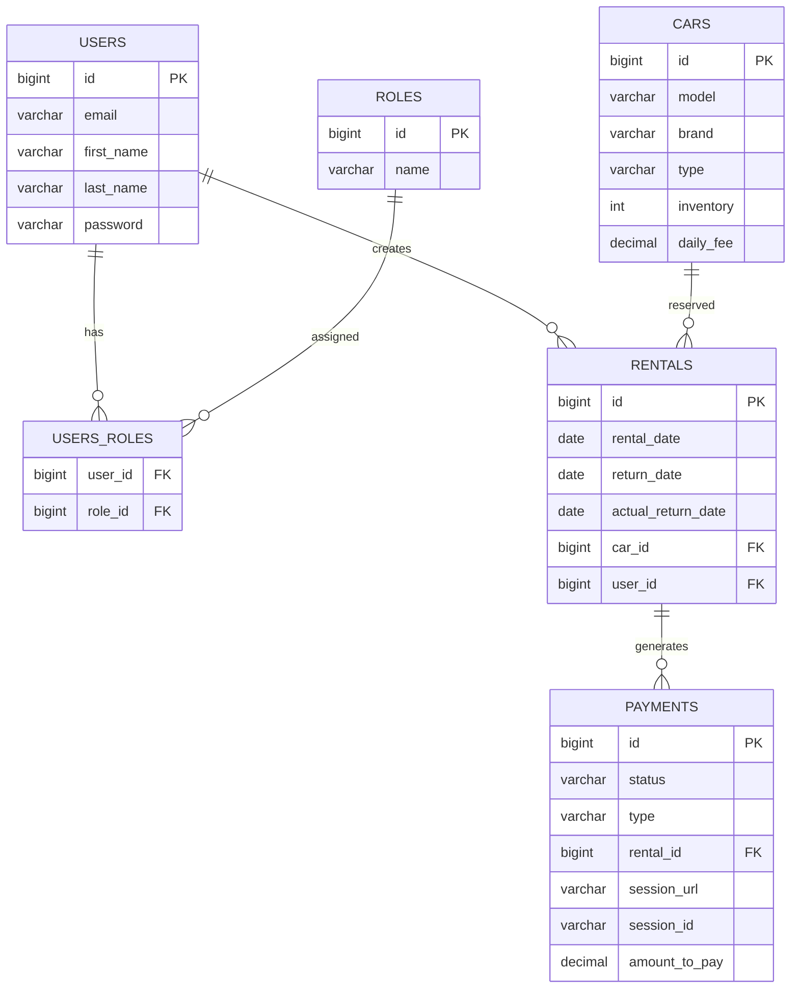

# Car Sharing App

REST API for a car sharing service. The application manages cars, rentals,
payments, users, and administrator notifications.

## Features

- JWT authentication and role-based authorization
- Public car catalog
- Manager-only car inventory management
- Rental creation, filtering, details, and return flow
- Automatic payment creation for rentals and overdue fines
- Stripe Checkout integration for payments
- Stripe webhook support for marking payments as paid
- Telegram notifications for new rentals, overdue rentals, and successful payments
- Swagger UI documentation
- Liquibase database migrations
- Docker Compose setup
- Repository, service, and controller tests
- GitHub Actions CI with `mvn clean verify`

## Tech Stack

- Java 17
- Spring Boot 3
- Spring Security
- Spring Data JPA
- MySQL
- Liquibase
- MapStruct
- Stripe Java SDK
- Telegram Bot API
- Docker Compose
- Testcontainers
- JUnit 5 / Mockito / MockMvc

## Requirements

- Java 17+
- Maven 3.9+
- Docker Desktop
- Stripe account in test mode
- Telegram bot and chat id, if notifications are enabled

## Clone Project

```bash
git clone https://github.com/egorkharaim/car-sharing-app.git
cd car-sharing-app
```

## Model Diagram



## Environment

Copy the sample file and fill in local values:

```bash
cp .env.sample .env
```

For Windows PowerShell:

```powershell
Copy-Item .env.sample .env
```

Important variables:

```env
MYSQLDB_DATABASE=car_sharing
MYSQLDB_USER=root
MYSQLDB_ROOT_PASSWORD=password

JWT_SECRET=change-me-to-a-long-secret-key

STRIPE_SECRET_KEY=sk_test_your_key
STRIPE_WEBHOOK_SECRET=whsec_your_secret
STRIPE_CURRENCY=usd

TELEGRAM_ENABLED=false
TELEGRAM_BOT_TOKEN=your_bot_token
TELEGRAM_CHAT_ID=your_chat_id
```

Never commit real `.env` values. The `.env` file is ignored by Git.

## Run With Docker

```bash
docker compose up --build
```

The application will be available at:

```text
http://localhost:8080
```

Swagger UI:

```text
http://localhost:8080/swagger-ui/index.html
```

Health check:

```text
GET http://localhost:8080/health
```

MySQL from the host machine:

```text
Host: localhost
Port: 3307
Database: car_sharing
User: root
Password: value from MYSQLDB_ROOT_PASSWORD
```

To stop and remove containers:

```bash
docker compose down
```

To also remove the database volume:

```bash
docker compose down -v
```

## Run Locally Without Docker

Start MySQL and create a database:

```sql
CREATE DATABASE car_sharing;
```

Set environment variables or configure `application.properties`, then run:

```bash
mvn spring-boot:run
```

## Authentication Flow

Register a user:

```http
POST /auth/register
```

```json
{
  "email": "customer@test.com",
  "firstName": "Customer",
  "lastName": "Test",
  "password": "password123",
  "repeatPassword": "password123"
}
```

Login:

```http
POST /auth/login
```

```json
{
  "email": "customer@test.com",
  "password": "password123"
}
```

Use the returned token in Swagger Authorize:

```text
Bearer <token>
```

## Main Endpoints

Authentication:

- `POST /auth/register`
- `POST /auth/login`

Users:

- `GET /users/me`
- `PATCH /users/me`
- `PATCH /users/{id}/role`

Cars:

- `GET /cars`
- `GET /cars/{id}`
- `POST /cars`
- `PUT /cars/{id}`
- `DELETE /cars/{id}`

Rentals:

- `POST /rentals`
- `GET /rentals?userId=&isActive=`
- `GET /rentals/{id}`
- `PATCH /rentals/{id}/return`

Payments:

- `GET /payments?userId=`
- `POST /payments`
- `GET /payments/success?session_id=`
- `GET /payments/cancel?session_id=`
- `POST /payments/webhook`

Infrastructure:

- `GET /health`

## Roles

- `CUSTOMER` can view public cars, manage own profile, create rentals, return own rentals, and pay own payments.
- `MANAGER` can manage cars, update user roles, and view all rentals/payments.

Default roles are inserted by Liquibase.

## Payments And Stripe

The application creates `PAYMENT` records for rentals and `FINE` records for overdue returns.

To create a Stripe Checkout session:

```http
POST /payments
```

```json
{
  "paymentId": 1
}
```

The response contains `sessionUrl`. Open it and use Stripe test card:

```text
4242 4242 4242 4242
12/34
123
12345
```

After successful payment, Stripe redirects to:

```text
GET /payments/success?session_id={CHECKOUT_SESSION_ID}
```

The application checks the Stripe session and marks the payment as `PAID`.

The cancel endpoint returns a user-facing message:

```text
GET /payments/cancel?session_id={CHECKOUT_SESSION_ID}
```

## Stripe Webhook

Install and log in to Stripe CLI, then run:

```bash
stripe listen --forward-to localhost:8080/payments/webhook
```

Stripe CLI will print a webhook secret:

```text
whsec_...
```

Set it in `.env`:

```env
STRIPE_WEBHOOK_SECRET=whsec_your_secret
```

Restart the application after changing `.env`.

## Telegram Notifications

Create a bot with BotFather, get a chat id, and set:

```env
TELEGRAM_ENABLED=true
TELEGRAM_BOT_TOKEN=your_bot_token
TELEGRAM_CHAT_ID=your_chat_id
```

Notifications are sent for:

- New rental creation
- Successful payment
- Overdue rentals
- No overdue rentals for the scheduled check

The overdue scheduler is configured with:

```env
TELEGRAM_OVERDUE_CRON=0 0 9 * * *
```

## Tests

Run all checks:

```bash
mvn clean verify
```

Run only service unit tests:

```bash
mvn test -Dtest=*ServiceImplTest,OverdueRentalNotificationSchedulerTest
```

Controller and repository integration tests use Testcontainers with MySQL.
Docker Desktop must be running.

## Manual QA Checklist

- Register and login as a customer
- Register another user and promote to `MANAGER`
- Create a car as manager
- Create a rental as customer
- Check that a `PAYMENT/PENDING` payment was created
- Create a Stripe checkout session
- Pay with a Stripe test card
- Verify that payment becomes `PAID`
- Verify Telegram successful payment notification
- Return an overdue rental
- Verify that a `FINE/PENDING` payment was created
- Pay the fine through Stripe
- Verify Telegram notification with `Type: FINE`

## Notes

- Real secrets must stay in `.env` or environment variables.
- The repository contains only `.env.sample` without real values.
- The project is designed for test Stripe payments only.
